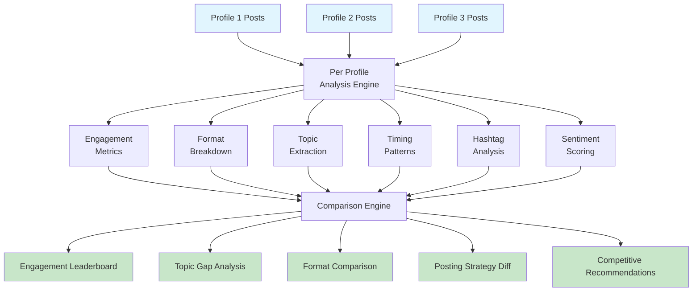

# LinkedIn Competitor Intelligence & Content Benchmarking

[](https://opensource.org/licenses/ISC)
[](https://apify.com/george.the.developer/linkedin-competitor-intel)
[](https://nodejs.org)
[](https://apify.com/george.the.developer/linkedin-competitor-intel)

The only LinkedIn competitive analysis tool on Apify. Compare 2 to 5 LinkedIn profiles side by side and get a data driven intelligence report showing who is winning, why they are winning, and exactly what you need to do to beat them.

## How It Works



## What You Get

Feed in post data from any 2 to 5 LinkedIn profiles and receive a complete competitive intelligence report:

**Engagement Leaderboard** ranks every profile by average engagement so you instantly see who is dominating.

**Format Comparison** reveals what content format works best for each competitor. One company might crush it with video while another wins with text posts. You will know exactly what to copy and what to avoid.

**Topic Gap Analysis** is the most valuable insight. The tool finds topics your competitors talk about that you never mention. These are content opportunities you are leaving on the table.

**Posting Strategy Diff** compares frequency, consistency, best posting days, and peak hours across all profiles. Find out if you are posting too little, too much, or at the wrong times.

**Hashtag Intelligence** shows which hashtags competitors use that you do not, and which hashtags drive the most engagement across all profiles combined.

**Sentiment Comparison** reveals the emotional tone each competitor uses and whether positive or negative content drives better results for different profiles.

**Competitive Recommendations** are the actionable output. Every recommendation references a specific competitor by name with real numbers. No generic advice. Only data backed moves you can execute today.

## Example Output

### Engagement Leaderboard

```
 Rank | Profile        | Avg Engagement | Posts | Top Format
 1    | Competitor A   | 482            | 45    | Video
 2    | Competitor B   | 310            | 62    | Carousel
 3    | Your Company   | 158            | 38    | Text
```

### Topic Gap Analysis

```json
{
  "topicGaps": [
    {
      "topic": "remote work culture",
      "usedBy": ["Competitor A", "Competitor B"],
      "avgEngagement": 520,
      "yourUsage": 0,
      "recommendation": "Competitor A gets 520 avg engagement on remote work content. You never post about this topic."
    },
    {
      "topic": "AI in hiring",
      "usedBy": ["Competitor B"],
      "avgEngagement": 380,
      "yourUsage": 0,
      "recommendation": "Competitor B owns this topic with 380 avg engagement. Consider creating content here."
    }
  ]
}
```

### Recommendations (sample)

```json
{
  "recommendations": [
    "Competitor A gets 3.1x your engagement. Their secret: 40% video content vs your 0%. Start posting 1 to 2 videos per week.",
    "Competitor B talks about #scaling which gets 380 avg engagement. You never mention this topic. Test 2 to 3 posts on scaling this month.",
    "You post 2.4x per week. Competitor A posts 3.8x. Increase frequency to at least 3x per week.",
    "Your best day is Wednesday but Competitor A peaks on Tuesday with 2.1x better results. Try shifting your schedule.",
    "Competitor B uses #leadership in 30% of posts with 290 avg engagement. You use it in 5%. Increase hashtag usage."
  ]
}
```

## Who This Is For

**Marketing agencies** benchmarking client LinkedIn performance against direct competitors. Run this monthly and show clients exactly where they stand with hard numbers.

**Sales teams** studying prospect content strategy before reaching out. Know what topics a company cares about before the first call.

**Personal branding coaches** comparing client profiles to industry leaders. Show clients the gap between where they are and where the top performers sit.

**Content strategists** planning LinkedIn content calendars. See what works for the competition and build your strategy around real data instead of guesswork.

## Input Format

Provide an array of profiles. Each profile needs a name and an array of posts. Posts should include text, engagement metrics, posting date, content type, and hashtags.

```json
{
  "profiles": [
    {
      "name": "Your Company",
      "posts": [
        {
          "text": "We just launched our new AI product!",
          "numLikes": 100,
          "numComments": 20,
          "numShares": 5,
          "postedAt": "2026-04-01T09:00:00Z",
          "type": "text",
          "hashtags": ["#ai"]
        }
      ]
    },
    {
      "name": "Competitor A",
      "posts": [
        {
          "text": "Excited to share our latest update.",
          "numLikes": 200,
          "numComments": 40,
          "numShares": 10,
          "postedAt": "2026-04-01T10:00:00Z",
          "type": "video",
          "hashtags": ["#ai", "#growth"]
        }
      ]
    }
  ]
}
```

Minimum 2 profiles, maximum 5. Each profile can have any number of posts. More posts means better analysis.

## Full Output Structure

```json
{
  "reportType": "competitive-intelligence",
  "profilesAnalyzed": 3,
  "generatedAt": "2026-04-12T14:30:00Z",
  "leaderboard": [
    { "name": "Competitor A", "avgEngagement": 482, "rank": 1 },
    { "name": "Competitor B", "avgEngagement": 310, "rank": 2 },
    { "name": "Your Company", "avgEngagement": 158, "rank": 3 }
  ],
  "comparison": {
    "engagementLeaderboard": [],
    "formatComparison": {
      "Competitor A": { "video": 40, "text": 35, "carousel": 25 },
      "Your Company": { "text": 80, "image": 20 }
    },
    "topicGapAnalysis": {},
    "hashtagIntelligence": {},
    "postingStrategyDiff": {},
    "sentimentComparison": {}
  },
  "recommendations": []
}
```

## Where to Get Post Data

Use any LinkedIn scraping tool that exports posts with engagement metrics. Compatible formats include output from:

- [LinkedIn Employee Scraper](https://apify.com/george.the.developer/linkedin-employee-scraper) on Apify
- HarvestAPI LinkedIn Profile Posts (free on Apify Store)
- PhantomBuster LinkedIn exports
- Any tool that exports numLikes, numComments, numShares, text, postedAt, and type fields

## Pricing

| Reports | Cost |
|---------|------|
| 1 report | $0.02 |
| 10 reports | $0.20 |
| 50 reports (monthly agency use) | $1.00 |
| 100 reports | $2.00 |

Pay per event. No subscriptions. No monthly minimums.

Compare that to hiring a social media analyst at $5,000+ per month to do the same competitive research manually.

## Related Actors

| Actor | What It Does | Link |
|-------|-------------|------|
| LinkedIn Content Analyzer | Deep dive into a single profile with engagement, timing, and topic analysis | [View](https://apify.com/george.the.developer/linkedin-content-analyzer) |
| LinkedIn Employee Scraper | Extract employee data from any LinkedIn company page | [View](https://apify.com/george.the.developer/linkedin-employee-scraper) |
| Entity OSINT Analyzer | Deep open source intelligence on any person or company | [View](https://apify.com/george.the.developer/entity-osint-analyzer) |
| Sentiment Analysis API | Analyze sentiment of any text instantly | [View](https://apify.com/george.the.developer/sentiment-analysis-api) |

## Built by George Kioko

50+ actors on Apify, 869+ users. More at [apify.com/george.the.developer](https://apify.com/george.the.developer)

Questions or feature requests? Open an issue on GitHub or reach out on X [@ai_in_it](https://x.com/ai_in_it).
